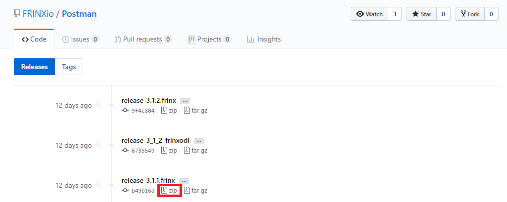
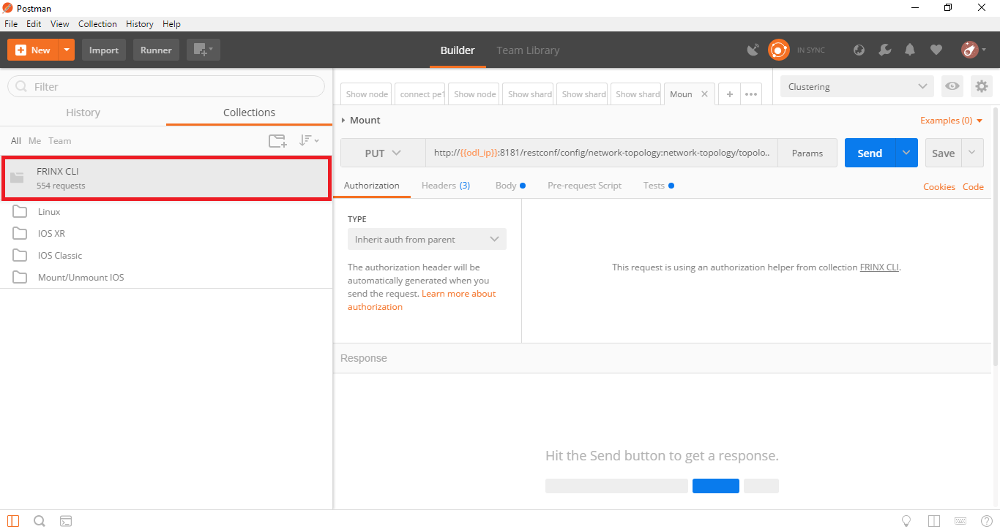

# Usage
Each new release of Frinx ODL (from 3.1.1 onwards) has associated Postman collections and environment files that form the API for interacting with Frinx ODL and are contained within this repository. For more info please see our main documentation page [here](https://frinxio.github.io/Frinx-docs/FRINX_ODL_Distribution/Carbon/API.html)  

To download:

1. Both the Frinx **Postman collection** and **Postman environment** files are grouped by Frinx ODL release (starting with 3.1.1) and packaged as zip files [here](https://github.com/FRINXio/Postman/releases). 
  
2. On that page, scroll to the release number that matches the Frinx ODL Distribution you are using, and click on zip to download.  

  

3. In a terminal on your local machine, unzip the downloaded file. This will create a new directory which contains subdirectories `Infrastructure`, `L2VPN Service Module`, `L3VPN Service Module` and `Uniconfig Framework`. Each contains at least one Postman collection file (and in some cases an associated Postman environment file).  

4. You can now import these Postman collection and environments files into Postman (which can be downloaded from [here](https://www.getpostman.com/)) as you require:  

Start Postman and click on `Import` near the top-left of the screen.   

In the pop-up window which opens, click to select the file you want to import (collection file or environment file). The collection or environment will now be available for use.  

  

For more information on particular modules, please see our documentation pages [here](https://frinxio.github.io/Frinx-docs/)

